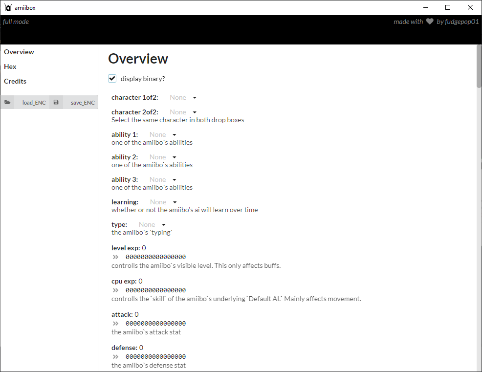
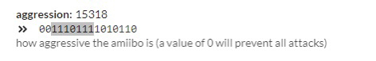
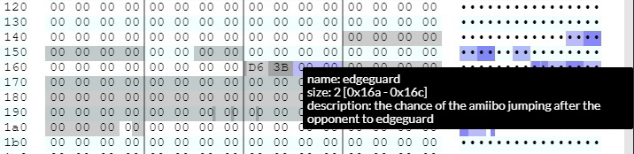

### Amiibox Homepage & Download Link: https://fudgepop01.github.io/amiibox/

### Discuss on Discord: https://discord.gg/2v6pcw3zzg

---

(this is the README for the *full* version of amiibox, which is released to the public at last!~

---

# Amiibox

Ladies and Gentlemen, welcome to the amiibox readme! Here you'll find out exactly
how this program functions and what it's all about! Now, without further ado:

## What is it?

Amiibox is a powerful amiibo modding suite that allows you to:
- read and write amiibo bins as encrypted files
- dynamically read from an editable `regions.txt` file to suit your needs
- edit the values specified in `regions.txt` in multitude of different ways
- edit the **behavior** of smash ultimate amiibo figures, something which typical apps are unable to do

Instead of just writing it all in text though, keep reading for some screenshots and an explaination
of the different parts of the app!

(note: screenshots captured using the *full* version of amiibox)

## Sections

### Startup

This page has a few important parts to it. I'll go over each button in detail.

#### Select Keys:

this button will initially be big and red with white text. Worry not though -
All you need to do to take care of it is click on it and select a file often called
`key_retail.bin`. You can find this through google. `key_retail.bin` is needed
to properly decrypt and reencrypt the amiibo's bin file. Without it, the program
really can't do most of its job.

#### Select Region Config:

This is where you would select a `regions.txt` file, [documented here](https://github.com/fudgepop01/amiibox/blob/master/static/amiibo/README.md).
This file contains information that amiibox uses to generate all the different interfaces
for modifying values within this tool.

#### RESET Region Config:

If your custom `regions.txt` file gets damaged or lost, you can still reset it to
default with this button. Amiibox comes bundled with its own regions.txt file automatically.
I try to update it whenever new information is found.

#### Begin

Pretty self-explanatory. Once everything is setup, click this to start!

### Overview

This is where most of the magic happens!

#### Left Section:

on the left there are buttons for importing and exporting amiibo files through a variety
of different methods.

- load_ENC / save_ENC
  - these are used to load and save encrypted amiibo bin files for use with tagmo or something

There are also list items above these IO buttons, "Overview," "Hex," and "Credits". 
Overview and Hex are used to swith between layouts, Credits is used to display the Credits screen. More on hex view later.

### The Actual Overview Section

#### Display Binary

this button is used to enable/disable editing the numeric values in here using a custom binary input
field. For most, this won't be useful - but for those that wish to experiment more with amiibo
AI they're a HUGE timesaver.

This is what it looks like with "Display Binary" box checked. This binary display appears
underneath the numeric input. This can also be edited directly using 1s, 0s, backspace,
and `i`. `1` will make the next bit a 1. `0` will make the next bit a 0. `backspace` will
make the previous bit a 0, and, when one or more bits are selected `i` will invert those
bits converting all 0s to 1s and vice versa. Negative two's compliment numbers are
handled properly as well.

As you'd expect, its respective numeric input updates as the bits are changed.

#### Editing Values Normally

The overview page is the main result of `regions.txt`. Everything you see has been rendered
according to that file. Each box with a number can be edited simply by selecting it and
entering the desired value. Don't worry about entering a number too big or too small -
each one will automatically conform to the max and min for its "type" (also specified in
`regions.txt`) as soon as you move away from it.

Dropdowns also exist, namely for spirit abilities and whatever other `ENUM` types
have been included in `regions.txt`. These are effectively named inputs, often used to make
it easier to know exactly what a particular value does. When an item is selected from the
dropdown menu, the respective number will automatically be set in the proper place by amiibox

### Hex

This is something most users of this can ignore. However, for those interested:

This is a page that utilizes a web-based hex editor I developed. It allows you to understand
exactly how data is stored within an amiibo. If you hover over one of these blue highlights,
known as "regions," a tooltip will appear telling you more about that region, as seen here:

An amiibo's data can also be edited using this interface by checking the "editable?"
checkbox up top. Both Hexadecimal and ASCII editing is supported depending on what part
you have selected.

**Warning, Undo/Redo is VERY unstable here despite my best efforts to get it under control.**

There is also a binary view that, you guessed it, also has regions in full-working order.
This allows you to see exactly what bits bit-based regions are modifying.

Something to keep in mind when editing in hex:

amiibo are stored in **little endian**. Google "binary endianness" for more information.

For a showcase of what this editor can really do or other use cases, check out:
- my video on [kaitai struct in visual studio code]()
  - shows an advanced use-case for documenting binary file formats
- http://fudgepop01.github.io
  - where I put up a demonstration with full control over the parameters

---

## Closing Statement

Thank you for reading this file! I hope you enjoy using this program! I spent **many** hours
working on this in my spare time, so if you really like it consider supporting me on ko-fi:

(ko-fi is like patreon except it deals mainly with 1-time transactions instead of subscriptions)

Ciao for now, and happy modding!~

\- `fudgepop01#0448`

---

<!-- old thing: "@pokusew/pcsclite": "^0.6.0", -->
